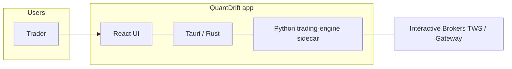

# QuantDrift OPT_BOT — System architecture

This document is the **maintainer-facing** view of how the desktop app is structured. It reflects a review using API-contract thinking (clear consumers, explicit message types, version discipline) and backend boundaries (sidecar as one deployable, IBKR as external system).

For day-to-day trading logic, see `.cursor/tradingLogic.md` and `docs/ROADMAP.md`.

---

## 1. Context (C4 Level 1)



- **Trader** operates one **desktop instance** per machine.
- **No cloud sync** of signals or positions between machines; each instance owns its config, process, and TWS session.

---

## 2. Containers (C4 Level 2)

| Container | Technology | Responsibility |
|-----------|------------|----------------|
| **UI** | React + TypeScript + Vite + Tailwind | Settings, dashboards, positions, logs; listens to `trading:*` Tauri events. |
| **Shell** | Tauri (Rust) | Window, licensing, **sidecar lifecycle**, JSON line protocol over stdio, maps sidecar events → `trading:{event}`. |
| **Trading engine** | Python 3.12 (`trading-engine/` + root `BOT.py` et al.) | TWS API client, `OrderManager`, strategy loop, emits events on stdout. |
| **Broker** | TWS / IB Gateway | Orders, positions, market data, PnL. |

**Monorepo note:** Frontend, Rust, and Python share one repo but **different** package managers (`npm`, `cargo`, `pip` in `trading-engine/.venv`). There is no Nx/Turborepo orchestration; builds are scripted (`npm run tauri:*`, `trading-engine/build.py`).

---

## 3. Bounded contexts (DDD-style, lightweight)

| Context | Owns | Must not own |
|---------|------|----------------|
| **Presentation** (`src/`) | View state, Zustand stores, Tauri command calls | Order placement rules, IBKR wire format |
| **Application shell** (`src-tauri/`) | Process boundaries, IPC bridging, persisted app config shape | Trading algorithms |
| **Protocol** (`trading-engine/protocol/`, `src-tauri/src/sidecar/protocol.rs`) | Method names, event names, JSON envelope | Business meaning of strikes/signals |
| **Trading domain** (`BOT.py`, `order_manager.py`, `option_targets.py`, `account_scope.py`) | Signals, sizing, TP/SL, cooldowns, account display rules | React component structure |
| **Infrastructure / IBKR** (`tws_api_client.py`) | Connection, callbacks, caches | UI copy |

Crossing boundaries: **config** flows UI → Rust → sidecar `start_trading` payload; **positions** flow TWS → engine → `position_update` event → Rust → UI.

---

## 4. Sidecar protocol contract (API-style)

**Transport:** One JSON object per line on **stdin** (requests) and **stdout** (responses + events).

### 4.1 Request envelope (Rust → Python)

```json
{ "id": "<uuid>", "method": "<method>", "params": { ... } }
```

### 4.2 Response envelope (Python → Rust)

```json
{ "id": "<uuid>", "result": <any> }
```
or
```json
{ "id": "<uuid>", "error": { "code": -1, "message": "<text>" } }
```

### 4.3 Event envelope (Python → Rust, unsolicited)

```json
{ "event": "<event_name>", "data": { ... } }
```

Rust forwards to the webview as **`trading:<event_name>`** (with special handling for `account_metrics` to avoid double emit — see `sidecar/manager.rs`).

### 4.4 Method names (canonical)

| Method | Purpose |
|--------|---------|
| `start_trading` | Start engine + TWS + BOT loop (`params.config`) |
| `stop_trading` | Stop and exit sidecar process |
| `emergency_stop` | Cancel / flatten per engine policy |
| `get_status` | Running / connected flags |
| `get_positions` | Open option legs + marks + SL/TP metadata |
| `close_position` | Params: symbol, strike, right, expiry |
| `close_all` / `close_calls` / `close_puts` | Bulk close |
| `update_config` | Hot config (where implemented) |
| `ping` | Liveness |
| `simulate_demo` | Demo pipeline |

**Source of truth (keep in sync):**

- Python: `trading-engine/protocol/messages.py`
- Rust: `src-tauri/src/sidecar/protocol.rs` → `methods::*`

### 4.5 Event names (canonical)

| Event | Typical `data` role |
|-------|---------------------|
| `tick_update` | Underlying / contract prices |
| `position_update` | Array of open positions |
| `order_update` | Order id, status, symbol |
| `pnl_update` | Daily / unrealized / realized |
| `account_metrics` | IBKR summary tags |
| `signal_detected` | Scanner hit |
| `signal_data` | Candle + signal rows for UI charts |
| `trade_executed` / `trade_closed` | Blotter / history |
| `log_message` | Batched `{ entries: [...] }` or single fields |
| `engine_status` / `connection_status` | Lifecycle |
| `data_status` | Feed health, queue depth, bar counts |
| `error` | Sidecar-reported errors |

**Source of truth (keep in sync):**

- Python: `trading-engine/protocol/messages.py` + `emitter.py` (uses those constants)
- Rust: `src-tauri/src/sidecar/protocol.rs` → `event_types::*`

---

## 5. Configuration flows

- **Trading parameters:** `config.json` at project root (and UI `configStore` mirroring keys) → written before/during `start_trading` → BOT globals + `TradingConfig`.
- **Account scope:** `ACCOUNT_ID` affects **order routing** (`order.account`) and **position filtering** (with fail-open if id ∉ TWS `managedAccounts`) — see `account_scope.py` and `CLAUDE.md`.

---

## 6. Start Trading → first data (15–20s latency budget)

The UI returns as soon as the sidecar accepts `start_trading`; **charts and “data flowing”** appear only after `TradingEngine._start_data_feed_and_strategies()` finishes. Typical delays:

| Phase | Where | Why |
|--------|--------|-----|
| **Cold sidecar** | First click only | Spawns Python, imports `BOT`, `pandas`, `ibapi`, etc. (often **several seconds** on HDD / first run). |
| **TWS connect** | `_run_engine` | Until `isConnected`, no feed. |
| **Fixed pause** | `trading_engine.py` | `time.sleep` after `init_order_requests()` so positions/PnL callbacks can land (~**1s**, was 2s). |
| **Per-symbol strike chains** | `BOT.get_strikes_map` → `tws_api_client.get_strikes` | **Sequential** `reqSecDefOptParams` + wait per symbol — **N symbols × (IB round-trip, often ~0.5–2s each)**. This is usually the largest chunk with ~9 names. |
| **Underlying ticks** | `_wait_underlying_ticks_ready` | Up to **3s** until `last` is valid for each STK. |
| **Historical bars** | `subscribe_historical_data` per underlying | Fires async into `history_cache`; does not block the loop for completion, but competes for TWS bandwidth. |
| **Option snapshots** | Many OPT `snapshot=True` + `_wait_option_snapshots_ready` | Waits until **40%** of contracts have a mark or **timeout (~8s)**, then switches to streaming. |
| **Sync / threads** | `synchronize_positions`, `synchronize_orders`, start `event_processor` | Shorter than phases above; then `_data_feed_started` allows the main loop to drain ticks. |
| **Initial signal DataFrame** | Background thread | Extra **~2s** sleep before `scan_all_stocks_signals` — **dashboard signal table**, not first tick. |

**Improving later:** parallel strike requests need **per-request reqId state** (today one `ticker_strike_fetched` flag forces serialization). Reducing option snapshot timeout risks starting with sparse OPT marks.

---

## 7. Observability & failure modes

- **Logs:** Sidecar → `log_message` → Rust buffer → UI; also mirrored to loguru when `common` loads.
- **Protocol errors:** Malformed JSON → `emit_error` + continue; unknown method → error response with id.
- **TWS disconnect:** `connection_status`, engine reconnect loop; positions empty when IBKR shows flat.

---

## 8. Architectural decisions (ADR index)

| ADR | Title |
|-----|--------|
| [0001](architecture/adr/0001-protocol-contract-ownership.md) | Sidecar protocol: dual-source constants and change process |

Add new ADRs under `docs/architecture/adr/` for decisions that affect multiple layers.

---

## 9. Intentional non-goals

- **Multi-user real-time sync** between PCs.
- **Replacing** `BOT.py` with a full greenfield engine in one step (incremental extraction only).
- **Single package manager** for the whole repo (accepted polyglot cost).

---

## 10. Related files

| Area | Path |
|------|------|
| Rust IPC + spawn | `src-tauri/src/sidecar/` |
| Python handler | `trading-engine/protocol/handler.py` |
| Engine façade | `trading-engine/engine/trading_engine.py` |
| Roadmap / protocol narrative | `docs/ROADMAP.md` |
