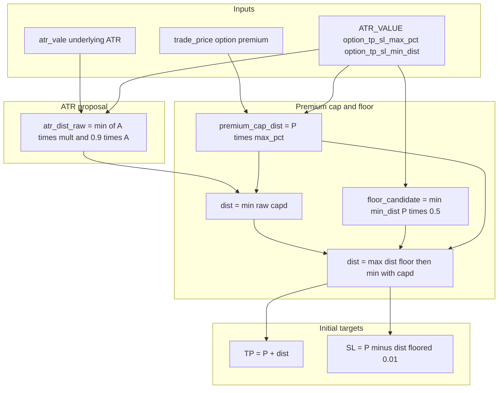

# Initial TP & SL calculation (detailed)

This document describes **how initial take-profit (TP) and stop-loss (SL) are calculated** for **long option entries** on the live path: `BOT.takeTrade` → `option_targets.targets_from_config` → `compute_option_tp_sl`.

**Source of truth in code:** [`option_targets.py`](../option_targets.py), [`BOT.py`](../BOT.py) (`takeTrade`, ~2331–2510).

---

## Scope (long vs short)

| Topic | What this doc covers |
|--------|----------------------|
| **Initial TP/SL numbers** | **Long options only.** The live entry path always uses **`action="BUY"`** in `takeTrade`; `compute_option_tp_sl` assumes a **long** premium position: TP **above** entry, SL **below** entry (symmetric `dist`). There is **no** parallel `compute_option_tp_sl` for short-option entries in this codebase. |
| **Runtime exit logic** | [`order_manager.py`](../order_manager.py) implements **both** **long (`BUY`)** and **short (`SELL`)** branches in `check_take_profit` and `check_stop_loss` (different exit marks and inequalities). If you ever had a managed **short** option position, exits would use that logic—but **initial** targets for new trades from `takeTrade` are still computed with the **long** model above. |

So: **yes—the formulas and examples in this document are for long positions (long options) only**, matching production `takeTrade` behavior.

---

## Short answer: ATR-based proposal, premium-capped result

Initial TP and SL are **not** “pure ATR on the option premium.” They use a **hybrid**:

1. **Underlying (stock) ATR** proposes a **dollar width** in *option premium space* (same dollar units as the quote, e.g. $0.50 premium).
2. That width is **capped** so it never exceeds a **fraction of the option entry premium** (`option_tp_sl_max_pct`, default **15%** each side).
3. A **minimum width in dollars** (`option_tp_sl_min_dist`, default **$0.02**) is applied, then the result is **clamped again** so it still respects the premium cap.

So:

- **Yes:** the *first* step uses **underlying ATR** × `ATR_VALUE` and an internal **0.9×ATR** ceiling (`atr_dist_raw`).
- **But:** the **final** half-width `dist` used for TP/SL is **`min(atr_dist_raw, trade_price × max_pct)`**, with floors/caps as below.

**One distance `dist` applies symmetrically:**

- **Initial TP** = `trade_price + dist` (rounded)
- **Initial SL** = `trade_price - dist` (rounded; aux floored at $0.01)

---

## Inputs

| Symbol | Meaning |
|--------|--------|
| `trade_price` | Entry reference for the **option premium** (per share): ask if spread ≤ $0.03 (MKT), else bid (LMT). Set in `takeTrade` before TP/SL. |
| `atr_vale` | **Underlying** ATR (same units as stock price), from the algo path—not option implied vol ATR. |
| `ATR_VALUE` | Config multiplier (e.g. `0.99`) on `atr_vale`. |
| `option_tp_sl_max_pct` | Max fraction of premium for half-width (default `0.15` if omitted from config). |
| `option_tp_sl_min_dist` | Min half-width in dollars after capping (default `0.02`). |

Config keys are read in `targets_from_config` from the same dict `BOT` uses as `fileData` (see [`option_targets.py`](../option_targets.py) lines 90–105).

---

## Step-by-step formulas

Let:

- \(P\) = `trade_price`
- \(A\) = `atr_vale`
- \(m\) = `ATR_VALUE`
- \(f\) = `option_tp_sl_max_pct` (e.g. 0.15)
- \(d_{\min}\) = `option_tp_sl_min_dist` (e.g. 0.02)

### Step 1 — ATR raw half-width `atr_dist_raw` (stock-based)

If \(A \le 0.01\):

- `base_dist` = **0.02**
- `atr_risk_cap` = **0.018**

Else:

- `base_dist` = \(A \times m\)
- `atr_risk_cap` = \(A \times 0.9\)

Then:

\[
\texttt{atr\_dist\_raw} = \min(\texttt{base\_dist},\ \texttt{atr\_risk\_cap})
\]

This is the **“ATR proposal”** in premium dollars before any option-specific cap.

### Step 2 — Premium cap half-width

\[
\texttt{premium\_cap\_dist} = P \times f
\]

\[
\texttt{dist} = \min(\texttt{atr\_dist\_raw},\ \texttt{premium\_cap\_dist})
\]

### Step 3 — Minimum distance floor (then re-apply cap)

\[
\texttt{floor\_candidate} = \min(d_{\min},\ 0.5 \times P)
\]

\[
\texttt{dist} = \max(\texttt{dist},\ \texttt{floor\_candidate})
\]
\[
\texttt{dist} = \min(\texttt{dist},\ \texttt{premium\_cap\_dist})
\]

The second `min` ensures the floor **cannot** push width past the premium percentage cap.

### Step 4 — Initial TP / SL (symmetric)

\[
\texttt{TP} = \mathrm{round}(P + \texttt{dist},\ 2),\quad
\texttt{SL}_{\text{raw}} = \mathrm{round}(P - \texttt{dist},\ 2)
\]

If \(\texttt{SL}_{\text{raw}} < 0.01\), stored aux (**SL**) = **0.01**.

Also:

- `max_tp_price` = initial TP (trailing ceiling for longs in current model)
- `min_sl_price` = `round(max(0.01, P - dist), 2)`, aligned so it does not exceed stored aux when aux was floored

The engine stores **`dist_applied`** = final `dist` and **`atr_dist_raw`** for logging (`TP_SL_MODEL` in `BOT.py`).

---

## Flow (high level)

---

## Worked examples

Assume **`ATR_VALUE` = 0.99**, **`option_tp_sl_max_pct` = 0.15** (default if not in config), **`option_tp_sl_min_dist` = 0.02** (default).

Premium cap half-width is always:

\[
\texttt{premium\_cap\_dist} = P \times 0.15
\]

---

### Example A — ATR wants a wide band, premium cap wins (typical liquid name)

- \(P = 2.00\) → `premium_cap_dist` = **0.30**
- \(A = 1.50\) → `base_dist` = 1.485, `atr_risk_cap` = 1.35 → `atr_dist_raw` = **1.35**

Steps:

1. `dist` = min(1.35, 0.30) = **0.30**
2. `floor_candidate` = min(0.02, 1.00) = **0.02**
3. `dist` = max(0.30, 0.02) = **0.30**; min(0.30, 0.30) = **0.30**

**Result:**

- **TP** = 2.00 + 0.30 = **$2.30** (+15%)
- **SL** = 2.00 − 0.30 = **$1.70** (−15%)

**Interpretation:** Underlying ATR is large relative to the option premium; **initial TP/SL are entirely limited by the 15% premium rule**, not by ATR distance.

---

### Example B — Small ATR, minimum distance floor matters

- \(P = 1.00\) → `premium_cap_dist` = **0.15**
- \(A = 0.04\) (> 0.01) → `base_dist` = 0.0396, `atr_risk_cap` = 0.036 → `atr_dist_raw` = **0.036**

Steps:

1. `dist` = min(0.036, 0.15) = **0.036**
2. `floor_candidate` = min(0.02, 0.50) = **0.02**
3. `dist` = max(0.036, 0.02) = **0.036**; min(0.036, 0.15) = **0.036**

**Result:**

- **TP** ≈ **$1.04**
- **SL** ≈ **$0.96**

If ATR were even smaller so `atr_dist_raw` dropped below 0.02:

- After min step, `dist` would be raised to **0.02**, still capped by **0.15** max → TP **$1.02**, SL **$0.98**.

---

### Example C — Tiny underlying ATR (≤ 0.01 branch)

- \(P = 0.80\) → `premium_cap_dist` = **0.12**
- \(A = 0.008\) → `base_dist` = **0.02**, `atr_risk_cap` = **0.018** → `atr_dist_raw` = min(0.02, 0.018) = **0.018**

Steps:

1. `dist` = min(0.018, 0.12) = **0.018**
2. `floor_candidate` = min(0.02, 0.40) = **0.02**
3. `dist` = max(0.018, 0.02) = **0.02**; min(0.02, 0.12) = **0.02**

**Result:**

- **TP** = 0.80 + 0.02 = **$0.82**
- **SL** = 0.80 − 0.02 = **$0.78**

---

### Example D — Cheap premium: cap is small in dollars

- \(P = 0.40\) → `premium_cap_dist` = **0.06** (15% of $0.40)
- \(A = 2.00\) → `atr_dist_raw` = min(1.98, 1.80) = **1.80**

Steps:

1. `dist` = min(1.80, 0.06) = **0.06**
2. `floor_candidate` = min(0.02, 0.20) = **0.02**
3. `dist` = max(0.06, 0.02) = **0.06**; min(0.06, 0.06) = **0.06**

**Result:**

- **TP** = **$0.46**
- **SL** = **$0.34**

---

### Example E — Very cheap premium where cap is below $0.02 floor

- \(P = 0.10\) → `premium_cap_dist` = **0.015**
- `atr_dist_raw` large enough to exceed cap, e.g. \(A = 0.05\), `ATR_VALUE` = 0.99 → `atr_dist_raw` = **0.045**

Steps:

1. `dist` = min(0.045, 0.015) = **0.015**
2. `floor_candidate` = min(0.02, 0.05) = **0.02**
3. `dist` = max(0.015, 0.02) = **0.02** → then **min(0.02, 0.015) = 0.015**

**Result:** Final **`dist` = 0.015** (the **premium cap wins** over the $0.02 floor).

- **TP** = round(0.10 + 0.015, 2) = **$0.12**
- **SL** = round(0.10 − 0.015, 2) = **$0.09**

---

## After placement: not the same as “initial limit orders”

Initial **TP** is the starting **`current_profit_price`** for **trailing** logic in `OrderManager.check_take_profit` (uses **`profit_increment`** from config). Initial **SL** is a **fixed** level in `check_stop_loss` (with long-side `min_sl_price` handling). See [`order_manager.py`](../order_manager.py).

---

## Legacy orders without stored caps

`backfill_order_tp_sl_caps` in [`option_targets.py`](../option_targets.py) may set missing `max_tp_price` / `min_sl_price` from fill/limit using **±15% of ref** for recovery—not the primary path for new orders.

---

## Tuning cheat sheet

| Goal | Config knob |
|------|-------------|
| Tighter/wider **initial** TP & SL (both) | `option_tp_sl_max_pct` (e.g. 0.10 for 10% each way) |
| Higher minimum width in dollars (when ATR is tiny) | `option_tp_sl_min_dist` |
| Change how **aggressive** the ATR proposal is | `ATR_VALUE` (only matters when `atr_dist_raw` &lt; premium cap) |
| Trailing step size after fill | `profit_increment` (does **not** set initial TP distance) |

---

## Log lines to verify

In `BOT.takeTrade`:

- `PL_CALC` — shows `tradePrice` and `atrVale`
- `TP_SL_MODEL` — `atr_raw_dist`, `applied_dist`, and TP/SL dollars
- `TARGETS` — percent to TP, percent to SL, and R:R snapshot
